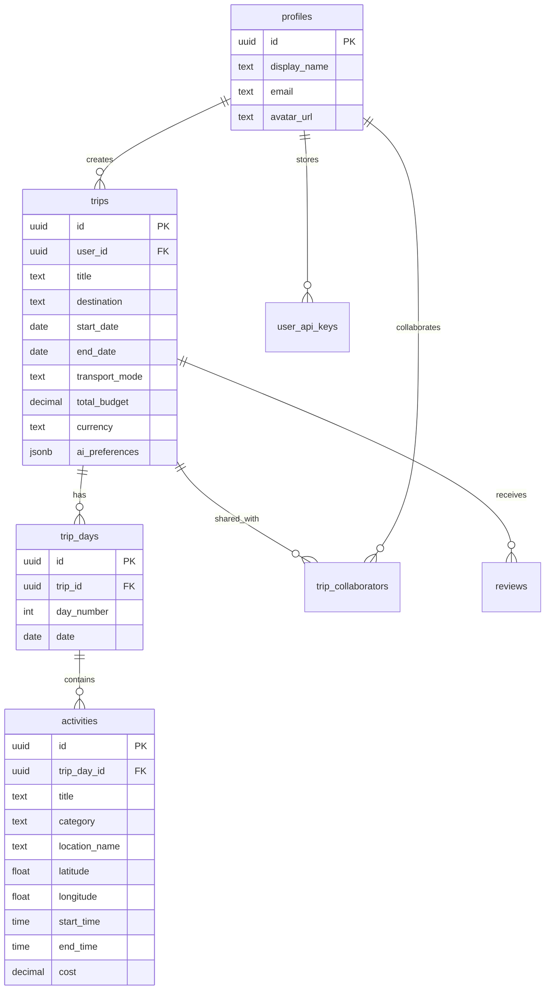

<p align="center">
  
  
  
  
  
</p>

# 🧭 WanderForge — Forge Your Perfect Journey

**WanderForge** is a full-stack, AI-powered travel itinerary planner that prioritizes **Experience > Time > Money**. Plan trips with AI assistance, visualize routes on interactive maps, collaborate in real-time, and export beautiful PDFs — all for free.

<p align="center">
  
  
  
  
</p>

---

## ✨ Features

### 🤖 AI-Powered Planning
- **Smart Itinerary Generation** — Groq AI (Llama 3.3 70B) creates optimized day-by-day plans
- **Conversational AI Chat** — Ask questions, get local tips, and refine your itinerary
- **BYOK Support** — Bring Your Own API Key for unlimited AI access
- **Auto-Geocoding** — Every activity is automatically mapped to coordinates

### 🗺️ Interactive Maps
- **Leaflet + OpenStreetMap** — Beautiful, free, interactive maps
- **Category-Colored Markers** — 11 activity categories with unique emoji markers
- **Route Visualization** — OpenRouteService routing with dashed polylines
- **Map ↔ Timeline Sync** — Click activities to highlight on the map and vice versa

### 🌤️ Weather & Budget
- **7-Day Forecasts** — Open-Meteo weather widgets on each day tab
- **Budget Tracking** — Real-time cost tracking with multi-currency support
- **Smart Suggestions** — AI considers weather and budget in its recommendations

### 👥 Real-Time Collaboration
- **Live Editing** — Multiple users can edit the same trip simultaneously
- **Presence Indicators** — See who's online with colored avatars
- **Role-Based Access** — Invite as Editor or Viewer
- **Supabase Realtime** — Powered by WebSocket channels

### 📄 Export & Share
- **PDF Export** — Styled itinerary with day sections, times, and costs
- **Calendar Export** — .ics files for Google Calendar & Outlook
- **Share Links** — Copy trip URL to clipboard

### 🎨 Design
- **Wanderlust Theme** — Earthy tones, glassmorphism, micro-animations
- **Dark/Light Mode** — System-aware theme with manual toggle
- **Fully Responsive** — Works on mobile, tablet, laptop, and TV
- **30 Curated Templates** — Pre-made itineraries for the world's most visited destinations

---

## 🛠️ Tech Stack

| Layer | Technology | Purpose |
|---|---|---|
| **Framework** | Next.js 16 (App Router) | Full-stack React with Turbopack |
| **Database** | Supabase (PostgreSQL) | Auth, DB, Realtime, Storage |
| **AI** | Groq (Llama 3.3 70B) | Itinerary generation & chat |
| **Maps** | Leaflet + OpenStreetMap | Interactive map visualization |
| **Routing** | OpenRouteService | Directions & distance calculations |
| **Weather** | Open-Meteo | 7-day weather forecasts |
| **Geocoding** | Nominatim | Location → coordinates |
| **Places** | Overpass API | Nearby point-of-interest discovery |
| **Styling** | Vanilla CSS | Custom design system with tokens |
| **Export** | jsPDF | PDF generation |

> 💡 **All APIs used are free-tier compatible** — no paid subscriptions required!

---

## 📁 Project Structure

```
wanderforge/
├── src/
│   ├── app/
│   │   ├── api/
│   │   │   ├── ai/
│   │   │   │   ├── generate/route.js    # AI itinerary generation
│   │   │   │   └── chat/route.js        # Conversational AI assistant
│   │   │   ├── collaborators/route.js   # Trip collaborator management
│   │   │   ├── geocode/route.js         # Nominatim geocoding proxy
│   │   │   ├── places/route.js          # Overpass API places proxy
│   │   │   └── weather/route.js         # Open-Meteo weather proxy
│   │   ├── auth/
│   │   │   ├── login/page.js            # Email/password login
│   │   │   ├── signup/page.js           # Signup with OTP verification
│   │   │   └── callback/route.js        # OAuth callback handler
│   │   ├── dashboard/page.js            # Trip cards, stats, welcome
│   │   ├── explore/page.js              # 30 destination templates
│   │   ├── profile/[id]/page.js         # User profile + BYOK keys
│   │   ├── trip/
│   │   │   ├── new/page.js              # 4-step creation wizard
│   │   │   └── [id]/page.js             # Full trip editor
│   │   ├── globals.css                  # Design system & tokens
│   │   ├── layout.js                    # Root layout with providers
│   │   └── page.js                      # Landing page
│   ├── components/
│   │   ├── layout/                      # Navbar, Footer
│   │   ├── maps/                        # TripMap, DynamicMap
│   │   ├── trip/                        # CollaborationPanel, AIChatPanel
│   │   └── ui/                          # Button, Input, Modal, Toast, etc.
│   ├── context/                         # AuthProvider, ThemeProvider
│   ├── hooks/                           # useRealtimeTrip
│   └── lib/
│       ├── supabase/                    # Client, server, middleware
│       └── exportUtils.js               # PDF & calendar export
├── supabase/
│   └── migrations/
│       ├── 001_initial_schema.sql       # Full database schema + RLS
│       ├── 002_enable_realtime.sql      # Realtime + collaborator policies
│       └── 003_fix_rls_recursion.sql    # Security definer functions
└── .env.local                           # API keys (not committed)
```

---

## 🚀 Getting Started

### Prerequisites
- **Node.js** 18+
- **Supabase** account (free tier)
- **Groq** API key (free tier)
- **OpenRouteService** API key (free tier)

### 1. Clone the repository

```bash
git clone https://github.com/gowdavidwan2003/WanderForge.git
cd WanderForge
npm install
```

### 2. Set up environment variables

Create a `.env.local` file in the root:

```env
# Supabase
NEXT_PUBLIC_SUPABASE_URL=your_supabase_url
NEXT_PUBLIC_SUPABASE_ANON_KEY=your_supabase_anon_key
SUPABASE_SERVICE_ROLE_KEY=your_service_role_key

# AI
GROQ_API_KEY=your_groq_api_key

# Maps & Routing
NEXT_PUBLIC_ORS_API_KEY=your_openrouteservice_key
OPENROUTESERVICE_API_KEY=your_openrouteservice_key
```

### 3. Set up the database

Run the SQL migrations in order in the **Supabase SQL Editor**:

1. `supabase/migrations/001_initial_schema.sql` — Tables, triggers, RLS
2. `supabase/migrations/002_enable_realtime.sql` — Realtime channels
3. `supabase/migrations/003_fix_rls_recursion.sql` — Security definer functions

### 4. Run the development server

```bash
npm run dev
```

Open [http://localhost:3000](http://localhost:3000) 🎉

---

## 📊 Database Schema



---

## 🗺️ Pages & Routes

| Route | Auth | Description |
|---|---|---|
| `/` | ❌ | Landing page with hero, features, CTA |
| `/auth/login` | ❌ | Email/password login |
| `/auth/signup` | ❌ | Signup with OTP email verification |
| `/dashboard` | ✅ | Trip cards, statistics, quick actions |
| `/explore` | ❌ | 30 curated destination templates |
| `/trip/new` | ✅ | 4-step trip creation wizard |
| `/trip/[id]` | ✅ | Full trip editor with map & AI |
| `/profile/[id]` | ✅ | User profile with BYOK key management |

---

## 🔒 Security

- **Row Level Security (RLS)** on all tables
- **Security Definer functions** to prevent RLS recursion
- **API keys** stored in `.env.local` (never committed)
- **Server-side proxies** for all external API calls
- **BYOK encryption** — user keys stored securely in Supabase

---

## 🤝 Contributing

1. Fork the repository
2. Create a feature branch (`git checkout -b feature/amazing-feature`)
3. Commit your changes (`git commit -m 'feat: add amazing feature'`)
4. Push to the branch (`git push origin feature/amazing-feature`)
5. Open a Pull Request

---

## 📝 License

This project is licensed under the MIT License.

---

## 🙏 Acknowledgments

- [Next.js](https://nextjs.org/) — The React framework
- [Supabase](https://supabase.com/) — Open source Firebase alternative
- [Groq](https://groq.com/) — Ultra-fast AI inference
- [Leaflet](https://leafletjs.com/) — Open source interactive maps
- [OpenRouteService](https://openrouteservice.org/) — Routing & directions
- [Open-Meteo](https://open-meteo.com/) — Free weather API
- [jsPDF](https://github.com/parallax/jsPDF) — PDF generation

---

<p align="center">
  Made with ❤️ by <a href="https://github.com/gowdavidwan2003">Vidwan Gowda H M</a>
</p>
